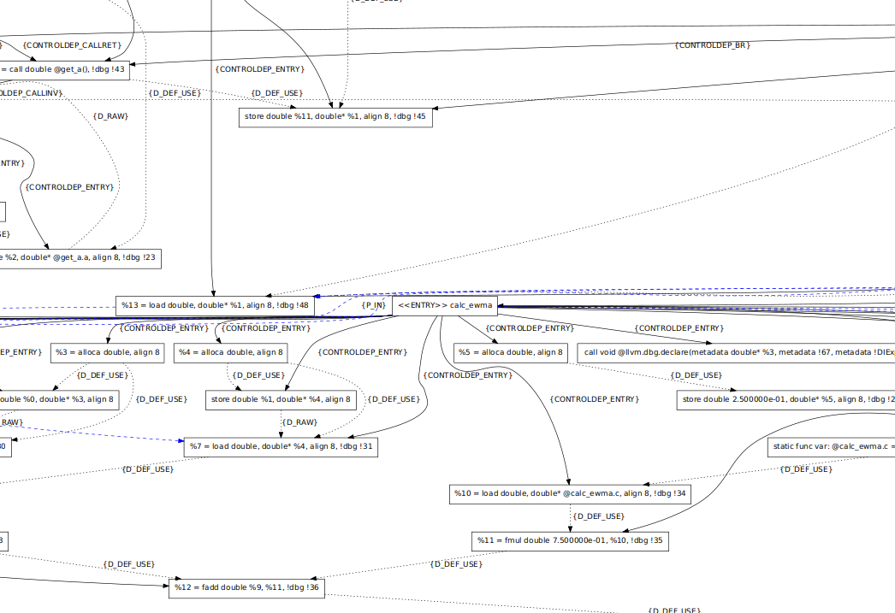

## Conflict Analyzer Using MiniZinc Constraint Solver {#conflict-analyzer}  

The role of the conflict analyzer is to evaluate a user annotated program and decide if the annotated program respects the allowable information flows specified in the annotations. As input, the conflict analyzer requires the user annottated C source code. Based on this, if it is properly annotated and a partition is possible it will provide an assignment for every global variable and function to an enclave (topology.json). If the conflict analyzer detects a conflict, it produces a report guiding users to problematic program points that may need to be refactored or additional annotations applied.


The conflict analyzer uses a constraint solver called [MiniZinc @minizinc_handbook ](https://www.minizinc.org/doc-2.5.5/en/index.html)  to perform program analysis and determine a correct-by-construction partition that satifies the constraints
specified by the developer using CLE annotations. MiniZinc provides a high level
language abstraction to express constraint solving problems in an intuitive manner.
MiniZinc compiles a MiniZinc language specification of a problem for 
lower level solver such as Gecode. We use an Integer Logic Program (ILP) 
formulation with MiniZinc. MiniZinc also includes a tool that computes
the minimum unsatisfiable subset (MUS) of constraints if a problem
instance is unsatisfiable. The output of this tool can be used to
provide diagnostic feedback to the user to help refactor the program.

In addition to outputing a `topology.json` providing the assignments of global and function variables, the conflict analyzer can also provide a more detailed version of this file `artifact.json`. This file provides the label, level, and enclave assignments to every program element.


Downstream tools in the CLOSURE toolchain will use the output of the solver to
physically partition the code, and after further analysis (for example, to
determine whether each parameter is an input, output, or both, and the size of
the parameter), the downstream tools will autogenerate code for the marshalling and
serialization of input and output/return data for the cross-domain call, as
well as code for invocation and handling of cross-domain remote-procedure calls
that wrap the function invocations in the cross-domain cut. 

### Introduction to the Conflict Analyzer

### Usage 

The usage of the conflict analyzer is as follows:

```
usage: Conflict Analyzer [-h] [--temp-dir TEMP_DIR] [--clang-args CLANG_ARGS] [--schema [SCHEMA]] --pdg-lib PDG_LIB [--source-path SOURCE_PATH] [--constraint-files [CONSTRAINT_FILES [CONSTRAINT_FILES ...]]] [--output OUTPUT]
                         [--artifact ARTIFACT] [--conflicts CONFLICTS] [--output-json] [--log-level {DEBUG,INFO,ERROR}]
                         sources [sources ...]

positional arguments:
  sources               .c or .h to run through conflict analyzer

optional arguments:
  -h, --help            show this help message and exit
  --temp-dir TEMP_DIR   Temporary directory.
  --clang-args CLANG_ARGS
                        Arguments to pass to clang (paths should be absolute)
  --schema [SCHEMA]     CLE schema
  --pdg-lib PDG_LIB     Path to pdg lib
  --source-path SOURCE_PATH
                        Source path for output topology. Defaults to current directory
  --constraint-files [CONSTRAINT_FILES [CONSTRAINT_FILES ...]]
                        Path to constraint files
  --output OUTPUT       Output path for topology json
  --artifact ARTIFACT   artifact json path
  --conflicts CONFLICTS
                        conflicts json path
  --output-json         whether to output json
  --log-level {DEBUG,INFO,ERROR}, -v {DEBUG,INFO,ERROR}
```

As inputs the conflict analyzer takes in C source and header files and outputs a [topology.json](#xd-assignment) and possibly
an `artifact.json`. 

The pdglib can be found at `/opt/closure/lib/libpdg.so`. The soure path controls the `source_path` field in the 
topology. The `output-json` option will output diagnostics and results in a JSON form readable by [CVI](#cvi).

Note: the `--clang-args` is a comma separated list of arguments to pass to clang, and any paths given (e.g., 
includes) must be absolute. 

### The CLOSURE `preprocessor` {#preprocessor}

The CLOSURE preprocessor is a source transformer that will
take a given source or header file with CLE annotations, and produce

1. A modified source or header file with LLVM `__attribute__` annotations 
2. A cle-json file which contains a mapping from each label to its corresponding definition in JSON form. See appendix for
an [example cle-json file](#cle-extra).

The output C code of the preprocessor will go to a minimally modified LLVM clang that will support the CLOSURE-specific LLVM `__attribute__` annotations and pass them down to the LLVM IR level.

In addition, the preprocessor performs several well-formedness checks on the cle labels and definitions, using a [json schema](#cle-schema).

For example:

With an initial source C file containing the following:
```c
int *secretvar = 0;
```

The developer annotates the C file as follows:
```c
#pragma cle def ORANGE { /* CLE-JSON, possibly \-escaped multi-line with whole bunch of constraints*/ }  
#pragma cle ORANGE 
int *secretvar = 0;
```

After running the preprocessor, we get a C file with pragmas removed but with `__attribute__` inserted (in all applicable places), e.g.,:
```c
#pragma clang attribute push (__attribute__((annotate("ORANGE"))), apply_to = any(function,type_alias,record,enum,variable(unless(is_parameter)),field))
int *secretvar = 0;
#pragma clang attribute pop
```

### `opt` pass for the Program Dependence Graph (PDG)

The Program Dependence Graph (PDG)@program_mandering @kSplit @ptrsplit is an abstraction over a C/C++ program which specifies its control and data dependencies in a graph data structure. The PDG is computed by adding an anlysis pass to clang. The resulting graph is then parsed into a format that MiniZinc can reason about.



 
During the invocation of the conflict analyzer, a subprocess is spawned in python to retrieve this `minizinc` (problem instance in MiniZinc format) representation of the PDG.


The relevant PDG node types for conflict analysis are Inst (instructions), VarNode (global, static, or module static
variables), FunctionEntry (function entry points), Param (nodes denoting
actual and formal parameters for input and output), and Annotation (LLVM IR
annotation nodes, a subset of which will be CLE labels). The PDG edge types
include ControlDep (control dependency edges), DataDep (data dependency edges),
Parameter (parameter edges relating to input params, output params, or
parameter field edges to encode parameter trees), and Annot (edges that connect
a non-annotation PDG node to an LLVM annotation node). Each of these node and
edge types are further divided into subtypes. 

More documentation about the specific nodes and edges in the PDG can be found [here](#pdg-appendix). 

### input generation and constraint solving using Minizinc

From the cle json outputted by the preprocessor, the conflict analyzer generates
a `minizinc` representation of the cle json, which describes the annotations
and enclaves for a given program. The `minizinc` produced from the cle json
is designed to be used with the PDG `minizinc` representation, and together
provide a full representation of the program and the constraints provided by the annotations
in `minizinc` form. A sample minizinc representation for example 1 can be found in the [appendix](#constraint-appendix).

Together, this can be fed, along with a set of constraints described in section [constraints](#constraints), to `minizinc`
producing an assignment of every node in the PDG to a label, or a 
minimally unsatisfied set of constraints. Understanding these constraints is crucial to
understanding why a certain program cannot pass the conflict analyzer.

From these assignments, the `topology.json` and `artifact.json` can be generated.

### Diagnostics using findMUS

Diagnostic generation produces commandline output
containing source and dest node and grouped by the constraints violated in MiniZinc.
When given `--output-json` it should also produce a machine readable `conflicts.json` which can be ingested by [CVI](#cvi)
to show these errors in VSCode.
